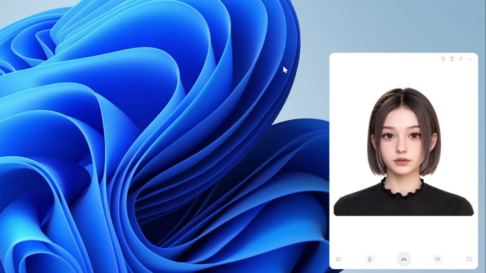

# Olivia Soul

以米哈游林离 [林离Olivia](https://space.bilibili.com/3546934956526060) 为人格的 Windows 桌面陪伴宠物：可以和你实时语音聊天、记住相处中的信息、按需看懂屏幕，也能在后台完成你交代的电脑任务。基于 Electron + TypeScript，对话与记忆接入阿里云百炼，电脑任务连接自行运行的 DeepSeek Harness（dsh）。

## 演示视频

[](https://amadeus.kingbridge.top/olivia-demo.mp4)

[▶ 点击封面或此处，在浏览器中播放演示视频](https://amadeus.kingbridge.top/olivia-demo.mp4)

## 功能与技术亮点

- **全双工实时语音**：麦克风音频持续上行，回复音频流式下行；支持在 Olivia 说话时插话打断，也支持文字输入。
- **跨会话长期记忆**：通过百炼应用的长期记忆能力，按固定 `user_id` 关联用户信息与偏好；开发模式提供记忆列表、用户画像查询，以及单条记忆的创建、修改和删除。
- **按需屏幕识别**：可以问“看看我现在的屏幕”或“这个报错是什么意思”。Olivia 截取当前主屏幕，将图片交给百炼多模态应用理解，再结合对话回答。
- **边聊天边执行任务**：电脑任务交给 dsh 在后台运行，对话可以继续；支持查询进度、追加要求、取消任务，并在完成后反馈结果。
- **音频驱动人物视频**：可选接入 SoulX-FlashHead Lite，根据回复音频生成说话画面。没有 GPU 也能使用语音、记忆、屏幕识别和电脑任务。

### 阿里云 API 与接入方式

| 能力 | 当前使用的 API / 协议 | 在项目中的用途 |
| --- | --- | --- |
| 实时多模态对话 | DashScope WebSocket：`wss://dashscope.aliyuncs.com/api-ws/v1/inference`；模型协议 `multimodal-dialog`，`streaming: duplex`、上行 `mode: duplex` | 以 16 kHz PCM 上传语音、24 kHz PCM 接收回复；处理语音识别文本、对话状态、流式回复与打断。语音识别、对话和语音合成通过同一应用会话编排。 |
| 文字、工具结果与图片输入 | 同一 WebSocket 会话的 `RequestToRespond` 指令；`biz_params.command_results` 和 `parameters.images` | 发送文字请求、回传工具执行结果，以及将截图作为 Base64 图片送入当前对话。 |
| 长期记忆与用户画像管理 | `@alicloud/sfmmultimodalapp20250909` SDK；`QueryMemoryList`、`QueryUserProfile`、`CreateMemory`、`UpdateMemory`、`DeleteMemory` | 按应用、工作空间和用户身份管理云端记忆；管理接口另需 RAM AccessKey 与对应权限。 |
| 工具调用 | 百炼多模态应用的自定义指令 / 工具意图识别 | 将模型返回的工具调用分发到本地截图或 dsh 任务，并把结果交还模型继续回答。 |

屏幕识别使用 Electron `desktopCapturer` 按需获取**主屏幕**截图，压缩为 JPEG 后通过上述图片输入传给云端。正常截图不写入磁盘，也不持续共享屏幕；查看屏幕与执行电脑操作是两个独立工具。需要在百炼应用中配置图片输入支持及 `take_screenshot` 工具。

长期记忆需要在百炼应用中启用，并在后续会话沿用同一 `user_id`；具体提取与召回由云端应用负责。开发模式的记忆管理界面和 CLI 可用于核对、修改或删除记忆，便携包暂不支持管理凭据导入。

官方参考：[多模态应用配置](https://help.aliyun.com/zh/model-studio/multimodal-app-configuration) · [长期记忆 API](https://help.aliyun.com/zh/model-studio/long-term-memory-api) · [自定义指令](https://help.aliyun.com/zh/model-studio/custom-directive)。接入步骤见 [云端配置](docs/cloud.md)，数据流见 [隐私说明](docs/privacy.md)。

**需要 Remote Linux GPU。** 默认使用本地待机动画。人物说话视频目前使用远程 Linux GPU 服务；**本地 GPU 的部署与配置方式待实现**。

## 支持范围

- Windows x64，Node.js 24、Electron 44.2.0，精确依赖固定在锁文件。Electron 44 将运行时下载改为显式安装，首次执行 setup:electron。
- dsh Remote 按 `0.1.5-alpha.1` 核对，不保证任意新版兼容；用户配置执行模型与工具。
- GPU：Linux + NVIDIA CUDA、SoulX-FlashHead Lite。独立部署指南需在新 GPU 环境验收；原生 Windows、WSL、CPU 推理未验证。
- 记忆管理仅开发运行支持，可选。便携包不包含 dsh、模型、CUDA 或凭据，未配置代码签名。

## 快速开始：Remote Linux GPU

先按 [云端配置](docs/cloud.md) 创建自己的应用，准备 `app_id`、`key`、`workspace_id`。安装固定版本 dsh，在用户主目录启动：

```powershell
npm install -g @deepseek-ai/dsh@0.1.5-alpha.1
Set-Location $env:USERPROFILE
dsh web --no-open --port 8766
```

保持运行，在另一个窗口进入本仓库：

```powershell
npm ci
npm run setup:electron
Copy-Item .env.example .env
```

填写 `.env` 的云端字段与完整 `dsh_url`，保留 `gpu_enabled=false`。`dsh_cwd` 可留空或指定已有绝对目录，然后 `npm start`。

电话开始通话，键盘展开文字输入；文字交互同样需要接通。麦克风和扬声器分别静音，右上查看任务与记忆，右下打开 dsh。关闭窗口收进托盘，通过托盘退出。

dsh 是必需服务。不要从包含 Soul `.env` 的目录启动 dsh，它会读取环境文件并拒绝 `DSH_*` 字段。重启 dsh 会生成新 token，更新配置后重启 Soul，或结束通话与任务后重新导入。

## GPU 与配置

按 [GPU 部署](docs/gpu.md) 准备服务和 SSH 隧道，再设 `gpu_enabled=true`。GPU 不可用时退回待机、音频继续，不自动启动、重启或抢占 GPU。

**本地 GPU 配置：待实现。** 当前预留了可配置的 GPU 服务地址，后续补充本地部署、依赖安装与启动流程；Windows / WSL 本地 GPU 方案尚未验证。

[配置与迁移](docs/configuration.md) 说明字段、凭据与便携包导入。旧 Amadeus Soul 数据不会自动读取，需沿用旧记忆时显式设置原 `user_id`。

## 开发与打包

```powershell
npm run typecheck
npm test
npm run build
npm run test:desktop
npm run check:public
npm run package
```

离线和桌面协议测试无需账户、GPU 或真实 dsh；真实联调会产生费用，见 [开发与验证](docs/development.md)。便携包位于 `release/Olivia-Soul-0.1.2-win-x64.exe`，首次打开选择已填写的配置文件。

[架构](docs/architecture.md) · [隐私](docs/privacy.md) · [贡献](CONTRIBUTING.md) · [第三方许可](THIRD_PARTY_NOTICES.md)

代码与作者默认素材采用 [MIT](LICENSE)，第三方依赖与模型保留各自许可。
