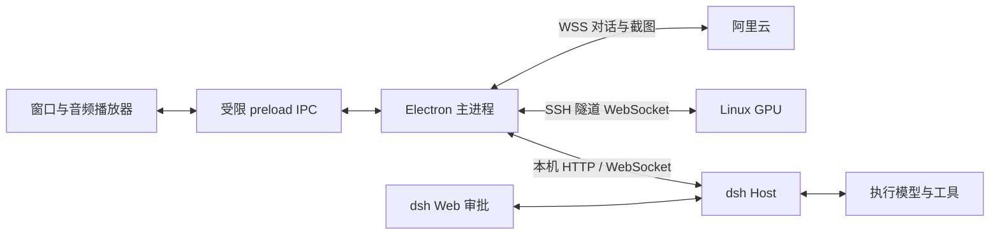

# 架构

src/main 管理连接、凭据、截图、工具、任务与记忆；preload 暴露业务 API；renderer 管理窗口、音频、播放时钟与视频。

GPU 可选，对话和 dsh 必需。GPU 同时一个客户端，隐藏释放、恢复重连；视频失败退回待机，音频继续。

上行 16 kHz PCM16，未发送缓存 30 秒；下行 24 kHz PCM，未播放缓存 540 秒循环复用。视频 512×512、25 fps，以播放 samples 控制 credit，GPU 音频上限 600 秒。

/stream 返回 ready；JSON begin 带 generation；二进制上行是小端 uint32 generation + PCM16，下行是 uint32 generation、uint32 frame index + JPEG。progress 带已播放 samples，end 结束，interrupt 清空；busy 返回 unavailable 并关闭。

每项任务独立 ID、dsh session 与请求，工具循环不等待后台任务。查询、继续明确 ID，重连不重发不确定请求，退出不关闭 dsh。
